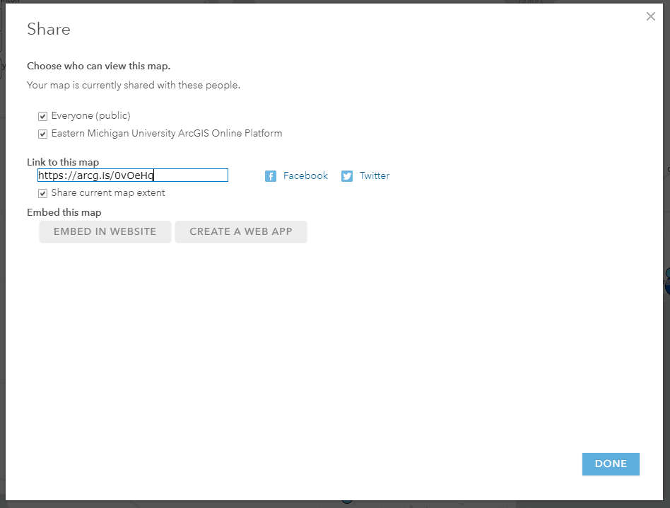

## COVID-19 Web Map Applications

Two web maps were created for this lab; one depicting the total number of COVID-19 cases for each US state, and one depicting the rate of COVID-19 cases for each US state. 

Both maps were created using ArcGIS Pro and ArcGIS Online. In order to make map 1, an excel file listing the total number COVID-19 cases for each US state as of April 2022 was acquired from the New York Times. This excel spreadsheet was exported as a CSV file and joined to a US state feature class based on state name in ArcGIS Pro. The map was then symbolized with graduated colors using the "Total COVID-19 Cases" field and shared to ArcGis online where it was saved as a web map. Lastly, an html was created using ArcGIS Online's "Embed in Website" option.

In order to make map 2, an excel file listing the rates of COVID-19 cases (number of cases per every 100,000 people) for each US state as of April 2022 was acquired from the New York Times. This excel spreadsheet was exported as a CSV file and joined to a US point feature class of each state center based on state name in ArcGIS Pro. The map was then symbolized with graduated symbols, a blue color ramp, and ranging transparency based on the "COVID-19 Rate" field and shared to ArcGIS Online where it was saved as a web map. Lastly, an html was created using ArcGIS Online's "Embed in Website" option.
